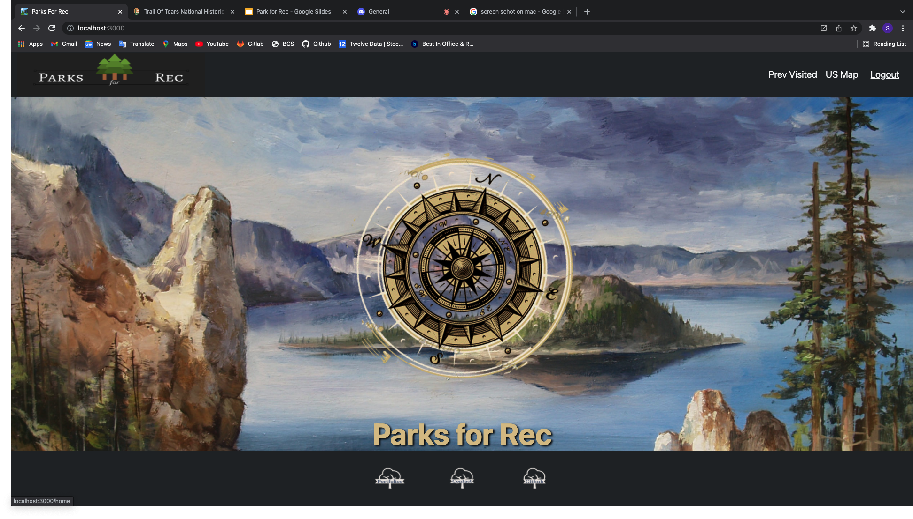
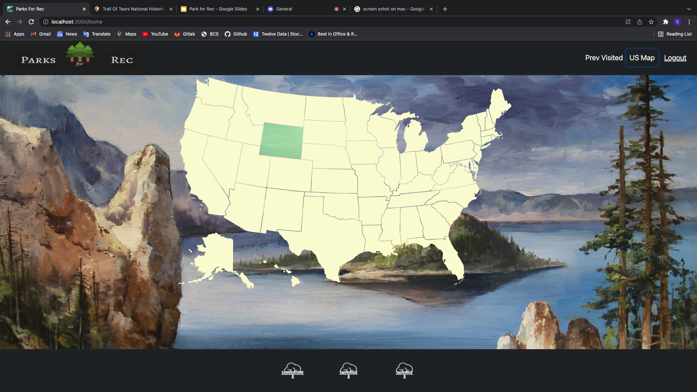
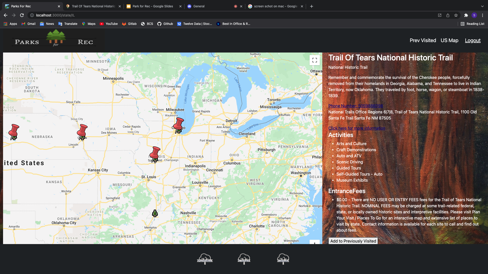
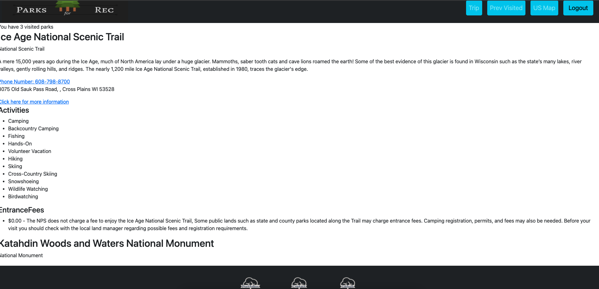

# Parks for Rec

## Description
Parks For Rec is an MERN full-stack application that allows the user to view all of the national parks in the US. The user can select a state, view all of national parks in that state, and see all of the activities that are available at that park. The user can also save the national parks that they have visited to keep track of how many they have been to.

## Live Deployment

[Here is a link to the live deployment of the application](https://floating-harbor-08984.herokuapp.com/)

## Table of Contents
  - [Technologies](#technologies)
  - [Installation](#installation)
  - [Usage](#usage)
  - [Contributing](#contributing)
  - [License](#license)
  - [Contributing](#contributing)
  - [Tests](#tests)
  - [Contact](#questions)

## Technologies:

- Bootstrap React Component Library
- Google Maps Library
- NPS.org API
- React-USA-Map NPM pkg
- GraphQL
- MongoDB
- Mongoose
- AtlasDB
- Express.js
- React.js
- Node.js

## Installation

Use git clone to clone this repository to your local drive

'''bash
git clone "insert repo"
'''

## Usage
  run npm start

## Contributing

Pull requests are welcome. For major changes, please open an issue first to discuss what you would like to change.

Please make sure to update tests as appropriate.

## License

[MIT](https://choosealicense.com/licenses/mit/)

## Contact

### Alex Cwiklinski
Email: alexcwik1490@gmail.com
Github: https://github.com/alexcwik

### Chris Franklin
Email: Chris.Franklin1701@gmail.com 
Github: https://github.com/Chris-Franklin-1701

### Sean Craig
Email: seancraig21@gmail.com 
Github: https://github.com/seanscraig

### Stew Sabation
Email: stewsabatino@gmail.com
Github: https://github.com/stewsabatino
